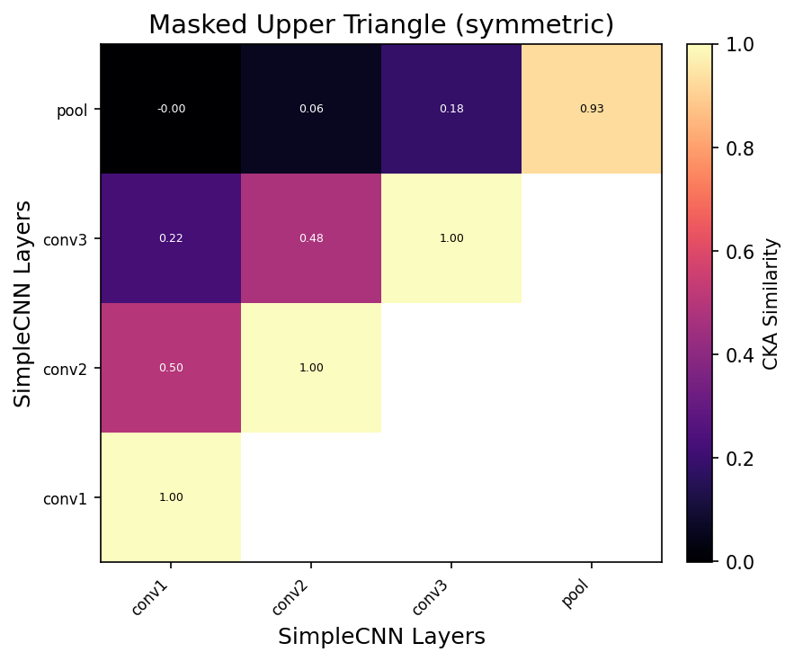
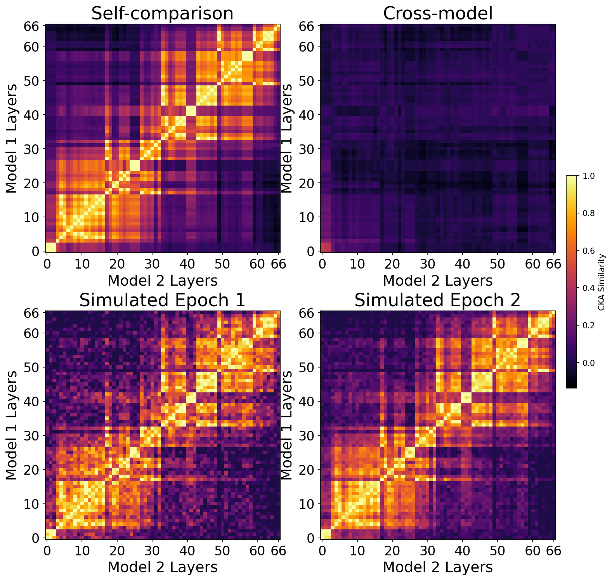

<div align="center">

# pytorch-cka

[](https://pypi.org/project/pytorch-cka/)
[](https://pypi.org/project/pytorch-cka/)
[](https://github.com/ryusudol/Centered-Kernel-Alignment/actions)

**The Fastest Python Library for CKA with Built-in Visualization**

</div>


<p align="center">
    <picture align="center">
        <source media="(prefers-color-scheme: light)" srcset="https://github.com/user-attachments/assets/97387076-7749-4971-a868-a10014c4ad36">
        <source media="(prefers-color-scheme: dark)" srcset="https://github.com/user-attachments/assets/71a99d79-c69e-4deb-a9aa-20e514f4cc80">
        
    </picture>
</p>

<p align="center">
  <i><b>3000%</b> faster CKA computation across all layers of two distinct ResNet-18 models on CIFAR-10 using NVIDIA H100 GPUs</i>
</p>


- ⚡️ Much faster than the [most popular CKA library](https://github.com/AntixK/PyTorch-Model-Compare)
- 📦 Memory-efficient minibatch CKA computation
- 🎨 Customizable visualizations: heatmaps and line charts
- 🧠 Supports HuggingFace models, DataParallel, and DDP
- 🐳 Installable via `pip` or `docker`
- 🛠️ Modern `pyproject.toml` packaging
- 🤝 Python 3.10–3.14 compatibility


## 📦 Installation

Requires Python >= 3.10.

```bash
# Using pip
pip install pytorch-cka

# Using uv
uv add pytorch-cka

# Using docker
docker pull ghcr.io/ryusudol/pytorch-cka:latest

# From source
git clone https://github.com/ryusudol/Centered-Kernel-Alignment
cd pytorch-cka
uv sync  # or: pip install -e .
```

## 👟 Quick Start

### Basic Usage

```python
from torch.utils.data import DataLoader
from cka import CKA

pretrained_model = ...  # e.g. pretrained ResNet-18
fine_tuned_model = ...  # e.g. fine-tuned ResNet-18

layers = ["layer1", "layer2", "layer3", "fc"]

dataloader = DataLoader(..., batch_size=128)

cka = CKA(
    model1=pretrained_model,
    model2=fine_tuned_model,
    model1_name="ResNet-18 (pretrained)",
    model2_name="ResNet-18 (fine-tuned)",
    model1_layers=layers,
    model2_layers=layers,
    device="cuda"
)

# Most convenient usage (auto context manager)
cka_matrix = cka(dataloader)
cka_result = cka.export(cka_matrix)

# Or explicit control
with cka:
    cka_matrix = cka.compare(dataloader)
    cka_result = cka.export(cka_matrix)
```

### Visualization

**Heatmap**

```python
from cka import plot_cka_heatmap

fig, ax = plot_cka_heatmap(
    cka_matrix,
    layers1=layers,
    layers2=layers,
    model1_name="ResNet-18 (pretrained)",
    model2_name="ResNet-18 (random init)",
    annot=False,          # Show values in cells
    cmap="inferno",       # Colormap
    mask_upper=False,     # Mask upper triangle (symmetric matrices)
)
```

<table>
    <tr>
      <td></td>
      <td></td>
      <!-- <td></td> -->
    </tr>
    <tr>
      <td align="center">Self-comparison</td>
      <td align="center">Cross-model</td>
      <!-- <td align="center">Masked Upper</td> -->
    </tr>
</table>

**Trend Plot**

```python
from cka import plot_cka_trend

# Plot diagonal (self-similarity across layers)
diagonal = torch.diag(matrix)
fig, ax = plot_cka_trend(
    diagonal,
    labels=["Self-similarity"],
    xlabel="Layer",
    ylabel="CKA Score",
)
```

<table>
    <tr>
      <td></td>
      <td></td>
    </tr>
    <tr>
      <td align="center">Cross Model CKA Scores Trends</td>
      <td align="center">Multiple Trends</td>
    </tr>
</table>

<!-- **Side-by-Side Comparison**

```python
from cka import plot_cka_comparison

fig, axes = plot_cka_comparison(
    matrices=[matrix1, matrix2, matrix3],
    titles=["Epoch 1", "Epoch 10", "Epoch 100"],
    layers=layers,
    share_colorbar=True,
)
```

<table>
    <tr>
      <td></td>
    </tr>
    <tr>
      <td align="center">CKA comparison grid</td>
    </tr>
</table> -->

## 📚 References

1. Kornblith, Simon, et al. ["Similarity of Neural Network Representations Revisited."](https://arxiv.org/abs/1905.00414) _ICML 2019._

2. Nguyen, Thao, Maithra Raghu, and Simon Kornblith. ["Do Wide and Deep Networks Learn the Same Things?"](https://arxiv.org/abs/2010.15327) _arXiv 2020._ (Minibatch CKA)

3. Wang, Tinghua, Xiaolu Dai, and Yuze Liu. ["Learning with Hilbert-Schmidt Independence Criterion: A Review."](https://www.sciencedirect.com/science/article/pii/S0950705121008297) _Knowledge-Based Systems 2021._

4. Hwang, Doyeon, et al. ["Tracing Representation Progression: Analyzing and Enhancing Layer-Wise Similarity."](https://arxiv.org/pdf/2406.14479v3) _arXiv 2024._

5. Davari, MohammadReza, et al. ["Reliability of CKA as a Similarity Measure in Deep Learning."](https://openreview.net/pdf?id=8HRvyxc606) _ICLR 2023._

6. Deng, Yuqi, et al. ["Manifold Approximation leads to Robust Kernel Alignment."](https://arxiv.org/pdf/2510.22953) _arXiv 2025._

7. Lee, Jeeyoon, et al. ["Path to Intelligence: Measuring Similarity between Human Brain and Large Language Model Beyond Language Task."](https://arxiv.org/pdf/2509.08831v1) _arXiv 2025._


## Related Projects

- [AntixK/PyTorch-Model-Compare](https://github.com/AntixK/PyTorch-Model-Compare)
- [RistoAle97/centered-kernel-alignment](https://github.com/RistoAle97/centered-kernel-alignment)
- [numpee/CKA.pytorch](https://github.com/numpee/CKA.pytorch)

## 📝 License

[MIT License](LICENSE)
